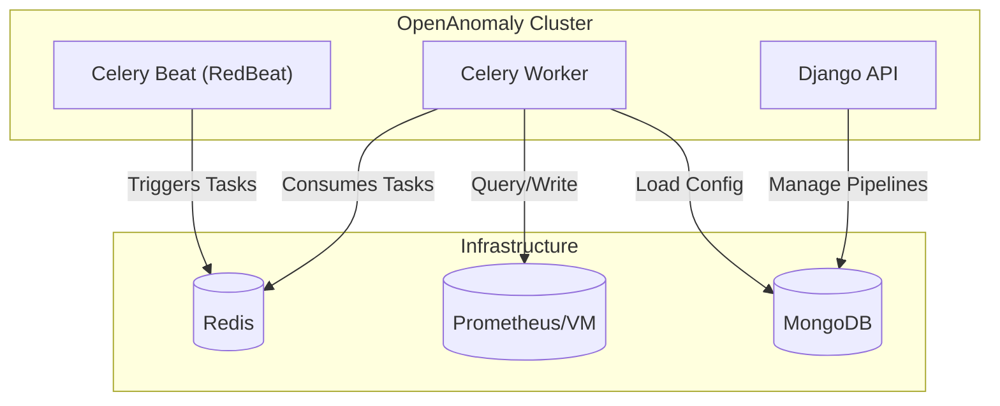

# OpenAnomaly

> **Zero-shot anomaly detection for Prometheus-compatible TSDBs using Time Series Foundation Models.**


## Vision

OpenAnomaly brings **real-time anomaly detection** to any **Prometheus-compatible TSDB** (VictoriaMetrics, Thanos, Mimir, Cortex) using **Time Series Foundation Models (TSFMs)**.

**No training required.** The system uses pre-trained models for **zero-shot forecasting**. It continuously queries your TSDB, runs inference, and writes anomaly scores back—just like VMAnomaly.

---

## Features

*   **Leading TSFMs**: Use the latest Time Series Foundation Models (Chronos, TimesFM, TOTO, Moirai).
*   **High Availability Scheduler**: Distributed scheduling using **Celery Beat** and **RedBeat** (Redis-backed), enabling active-passive redundancy.
*   **scalable Workers**: Horizontal scaling of Celery workers to handle thousands of pipelines.
*   **Prometheus Native**: Reads from Query API, writes to Remote Write API.
*   **Robust Configuration**: Validated YAML configuration using **Pydantic**.
*   **Database Agnostic**: Supports **MongoDB** (Production) and **SQLite** (Dev/Light).

---

## Architecture

OpenAnomaly follows a **Hexagonal Architecture** (Ports & Adapters) to decouple core logic from infrastructure.



---

## Quick Start

### 1. Prerequisites
*   Docker & Docker Compose
*   (Optional) `uv` for local development

### 2. Configuration (`config.yaml`)
OpenAnomaly uses a single YAML file for configuration, validated by Pydantic.

```yaml
django:
  debug: true
  secret_key: "your-secret-key"
  allowed_hosts: ["*"]

mongo:
  url: "mongodb://mongo:27017"
  db_name: "openanomaly"

redis:
  url: "redis://redis:6379/0"

prometheus:
  url: "http://prometheus:9090"
  write_url: "http://prometheus:9090/api/v1/write"
```

### 3. Run with Docker Compose
The easiest way to run the full stack (API, Worker, Beat, Redis, Mongo).

```bash
# Start all services
docker compose up -d

# Scale workers for higher throughput
docker compose up -d --scale worker=3

# Scale scheduler for High Availability (Active-Passive)
docker compose up -d --scale beat=2
```

### 4. Access
*   **Admin Panel**: [http://localhost:8000/admin/](http://localhost:8000/admin/) (Default: `admin` / `admin`)
*   **API Docs (Swagger)**: [http://localhost:8000/api/docs/](http://localhost:8000/api/docs/)
*   **API Schema (OpenAPI)**: [http://localhost:8000/api/schema/](http://localhost:8000/api/schema/)
*   **Health Check**: [http://localhost:8000/health](http://localhost:8000/health)

---

## Development

### 1. Install Dependencies
We use `uv` for fast dependency management.

```bash
# Install dependencies
uv sync

# Activate virtualenv
source .venv/bin/activate
```

### 2. Run Tests
```bash
# Run unit tests
pytest tests/unit

# Run integration tests (requires Docker services)
pytest tests/integration
```

### 3. HA Verification
To verify the High Availability Scheduler:
1.  Start 2 beat instances: `docker compose up -d --scale beat=2`
2.  Check logs: `docker compose logs -f beat`
    *   One instance will acquire the lock (`Acquired lock`).
    *   The other will wait (`Waiting for lock`).

---

## Deployment

*   **Scheduler**: Use `celery beat -S redbeat.RedBeatScheduler`. capable of running multiple instances for failover.
*   **Database**: MongoDB is recommended for production pipeline storage.
*   **Broker**: Redis is required for Celery and RedBeat.

## License
[Apache 2.0](LICENSE)
